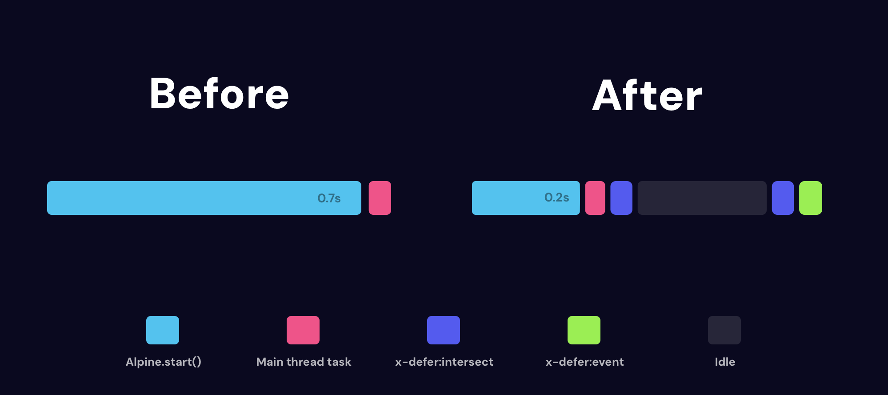

# alpinejs-defer

An Alpine.js directive designed to address the issue of large running tasks occupying main thread time by deferring components until they are needed.


## About

Alpine.js is an amazing tool, but as your component library grows, initializing them all on Alpine.start() or Livewire.start() can cause your application to freeze at the beginning of each request. This means other important tasks can't be performed until Alpine has traversed the entire DOM.



## Installation

> [!IMPORTANT]  
>  This plugin is only available as an ES module for the time being. 

### NPM

```bash
npm install arrowtide/alpine-defer
```

```js
import Alpine from "alpinejs";
import Defer from "arrowtide/alpinejs-defer";


Alpine.directive('defer', Defer).before('ignore');

Alpine.start();
```

## Usage


### `x-defer:intersect`

Will initialise the component just before it hits the window using the `IntersectionObserver` API.

```html
<div x-defer:intersect>
	...
</div>
```

### `x-defer:event

Will initialise the component when an event you specify is fired on the `window`. 

eg.

```html
<button x-data @click.window="$dispatch('open-navigation')">
	Open Navigation
</button>

<nav x-data="nav">

	
	...
	
	<!-- Some deeply nested component -->
	<div x-defer:event="open-navigation">
		...
	</div>
</nav>
```

> [!IMPORTANT]  
>  Events like `load` will not work properly and will cause components to sometimes not initialise. Events should come from a specific action, like a click that triggers your custom event. 


### `x-defer:interaction`

Will initialise the element when a user interacts with the page in any way.

### `x-defer`

Using the directive without a name, this will defer the component until _after_ all of the components without x-defer have been initialised. It will put each component onto a new task on the main thread, leaving room for other important tasks. 
